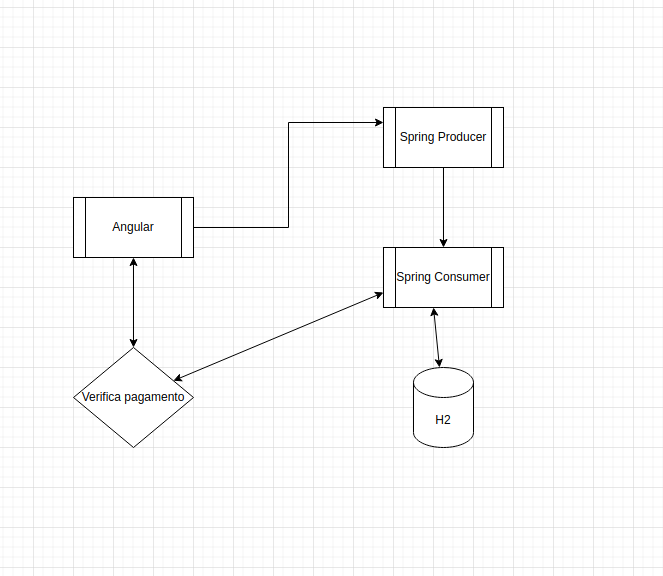

### Credit-Purchase
Esse projeto é uma aplicação que utiliza as tecnologias Kafka, ZooKeeper e Schema Registry e apache-avro. Ele consiste em um serviço Spring que atua como produtor (producer) e outro consumidor (consumer), além de salvar informações em um banco de dados. Também foi desenvolvido um front-end simples para simular uma compra utilizando o Angular.

**Ferramentas necessárias**
* Java 17
* Gradle 8.1.1
* Node 12.22
* Angular cli 10.0.4
* Docker
* Docker compose

**Para executar o projeto:**

1. Passo rodar os containers docker, abra o terminal no caminho /purchase-api e execute:
```
docker-compose up -d
``` 

2. Passo executar as aplicações spring dentro dos diretorios /purchase-api e /payment-confirm-api com seguinte comando:
```
gradle bootRun
```

3. Passo executar o front-end com seguintes comandos em /creditPurchase-front:
```
npm install
ng serve
```
*Agora só acessar: http://localhost:42000*

Ss:
